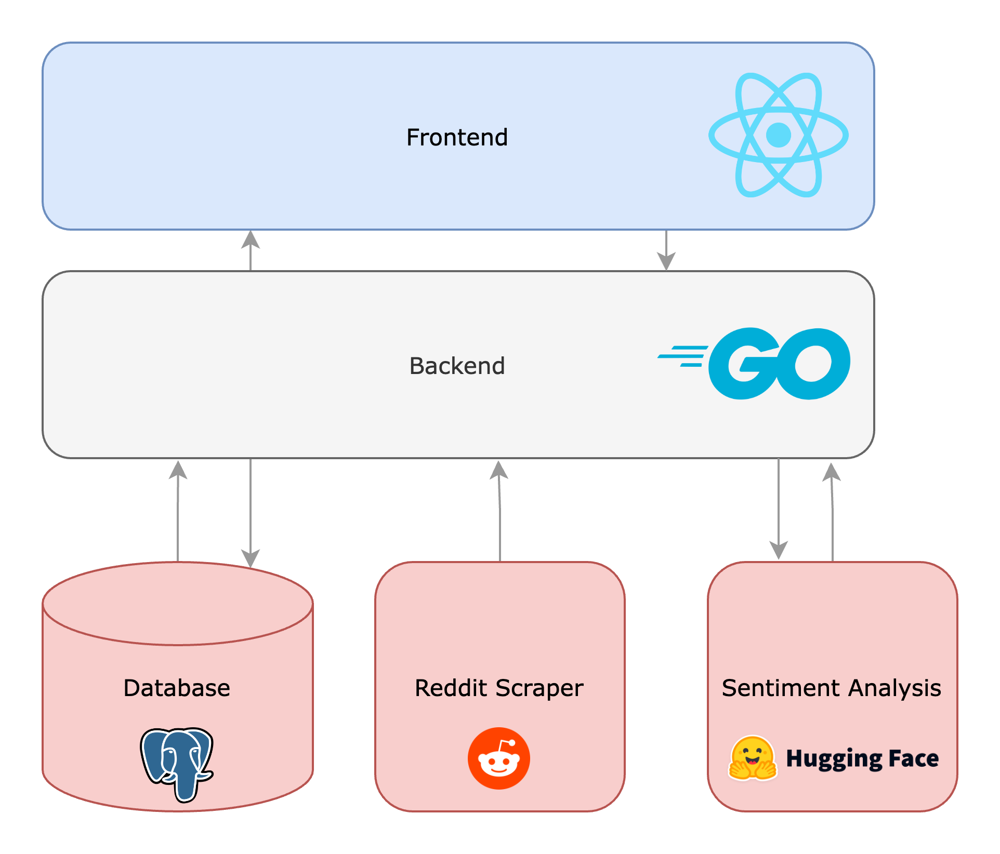

<h1 align="center">
  Metro NLP
</h1>
<h4 align="center">Comparing City Sentiments Through Reddit Data.</h4>

  <a href="#features">Features</a> •
  <a href="#license">License</a>

https://user-images.githubusercontent.com/73313777/234741052-da1095b8-b93e-4df6-a3ce-ee907a112e7e.mp4

## Features

>📊 Visualize city sentiment fluctuations over time using interactive charts.
>🔍 Search and explore sentiment data for cities based on Reddit posts.
>🌆 Discover the sentiment distribution of top posts for the current day.

## License

This project is licensed under the Apache License 2.0 License. See the LICENSE file for more information.
